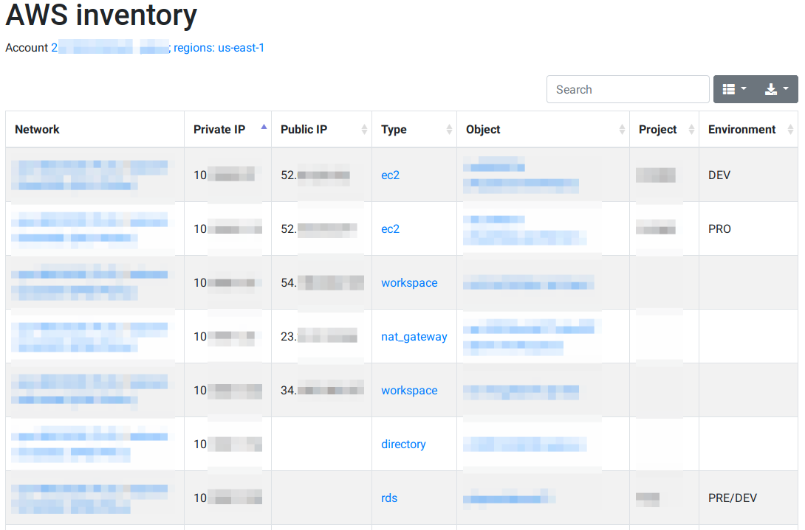

# AWS IP inventory

Tool to generate an inventory of all IP addresses in use in an account, one or multiple VPC, or one or multiple subnet.

Features:

* Detects the object type that uses the interface (EC2, RDS, etc.); not always possible because this guess is done using some magic from the interface description.
* Filter by region, VPC and/or subnet
* Guess a friendly name of the object (EC2 Name tag, for example)
* Gets project and environment tags
* Multiple output formats
* Links to AWS web console for services/objects

Output formats:

* Console table
* HTML
* JSON
* YAML
* CSV

Supported services:

* [x] EC2 instances
* [x] ElastiCache (partially)
* [x] ELB/ALB (ELBv2)
* [x] RDS
* [x] ECS tasks
* [x] NAT Gateways
* [x] EFS mount targets
* [x] Directories
* [x] Workspaces
* [x] Lambda
* [x] CodeBuild (only service, not object)
* [x] API Gateway VPC link
* [x] VPC endpoints
* [x] Route53 Resolver
* [x] Transit Gateway
* [x] RDS Proxy

Internally, the script gets the list of [network interfaces](https://boto3.amazonaws.com/v1/documentation/api/latest/reference/services/ec2.html#EC2.Client.describe_network_interfaces),
and tries to guess to what service and object the interface is attached to; this is not always possible, because there is no a direct property
to know it, and this must be guessed using regexs and string comparison using the interface description or the requester property.

Keep in mind that some network interfaces are ephemeral, i.e. they live only for a short period of time, like the ones used in Lambda,
ECS tasks, etc. Others have a longer life, like the ones used in "static" EC2 instances.

## Installation

Using [pip](https://pip.pypa.io/en/stable/):

```bash
pip install --user --force-reinstall --ignore-installed https://github.com/okelet/awsipinventory/archive/main.tar.gz
```

Cloning the repository:

```bash
pip install pipenv --user
git clone https://github.com/okelet/awsipinventory
cd awsipinventory
pipenv install
```

## Usage

Remember to add `~/.local/bin` to your path if not already done:

```bash
export PATH=${PATH}:${HOME}/.local/bin
```

```text
usage: awsipinventory [-h] [-l {DEBUG,INFO,WARNING,ERROR,CRITICAL}]
                      [-f {none,table,html,json,yaml,yml,csv}] [-o OUTPUT]
                      [--regions [REGIONS [REGIONS ...]]]
                      [--vpcs [VPCS [VPCS ...]]]
                      [--subnets [SUBNETS [SUBNETS ...]]]
                      [--columns [COLUMNS [COLUMNS ...]]]

optional arguments:
  -h, --help            show this help message and exit
  -l {DEBUG,INFO,WARNING,ERROR,CRITICAL}, --log-level {DEBUG,INFO,WARNING,ERROR,CRITICAL}
                        Set the logging level
  -f {none,table,html,json,yaml,yml,csv}, --format {none,table,html,json,yaml,yml,csv}
                        Output format
  -o OUTPUT, --output OUTPUT
                        Output file; defaults to standard output
  --regions [REGIONS [REGIONS ...]]
                        Use "all" to get data from all enabled regions
  --vpcs [VPCS [VPCS ...]]
                        Restrict results to specific VPCs (must exist in the
                        account and regions)
  --subnets [SUBNETS [SUBNETS ...]]
                        Restrict results to specific subnets (must exist in
                        the account, VPCs and regions)
```

Running from an standard Linux:

```bash
awsipinventory --format html --output /tmp/inventory.html && firefox /tmp/inventory.html
```

Running from WSL:

```bash
ln -s /mnt/c/Program\ Files/Mozilla\ Firefox/firefox.exe ~/.local/bin/firefox
awsipinventory --format html --output /tmp/inventory.html && firefox $(wslpath -w /tmp/inventory.html)
```

From local development environment or cloned repository:

```bash
pipenv run python -m awsipinventory
```

## Output examples

Console table:

```text
+-----------------------+----------+--------------------------+--------------------+--------------------+-------------------+-------------+--------------------------------------+------------------------------+---------+-------------+
|                VPC ID | VPC name |                Subnet ID |        Subnet name | Private IP address | Public IP address |    Type     |                  ID                  |             Name             | Project | Environment |
+-----------------------+----------+--------------------------+--------------------+--------------------+-------------------+-------------+--------------------------------------+------------------------------+---------+-------------+
| vpc-xxxxxxxx          | xxx      | subnet-xxxxxxxx          | xxxxxxxxx          |    10.xxx.x.xxx    |   52.xx.xxx.xxx   |     ec2     |              i-xxxxxxxx              |       xxxxxxxxxxxxxxx        |  xxxxx  |     PRO     |
| vpc-xxxxxxxx          | xxx      | subnet-xxxxxxxx          | xxxxxxxxx          |    10.xxx.x.xxx    |   52.0.xxx.xxx    |     ec2     |              i-xxxxxxxx              |       xxxxxxxxxxxxxxx        |  xxxxx  |     DEV     |
| vpc-xxxxxxxx          | xxx      | subnet-xxxxxxxx          | xxxxxxxxx          |    10.xxx.x.xx     |  54.xxx.xxx.xxx   |  workspace  |             ws-xxxxxxxxx             |           xxxxxxx            |         |             |
| vpc-xxxxxxxx          | xxx      | subnet-xxxxxxxx          | xxxxxxxxx          |    10.xxx.x.xxx    |  34.xxx.xxx.xxx   |  workspace  |             ws-xxxxxxxxx             |            xxxxxx            |         |             |
| vpc-xxxxxxxx          | xxx      | subnet-xxxxxxxx          | xxxxxxxxx          |    10.xxx.x.xxx    |                   |  directory  |             d-xxxxxxxxxx             |            xxxxx             |         |             |
| vpc-xxxxxxxx          | xxx      | subnet-xxxxxxxx          | xxxxxxxxx          |    10.xxx.x.xxx    |                   |     rds     |           xxxxxxxxxxxxxxx            |                              |   xxx   |   PRE/DEV   |
| vpc-xxxxxxxx          | xxx      | subnet-xxxxxxxx          | xxxxxxxxx          |    10.xxx.x.xxx    |                   |  directory  |             d-xxxxxxxxxx             |            xxxxx             |         |             |
| vpc-xxxxxxxx          | xxx      | subnet-xxxxxxxx          | xxxxxxxxx          |    10.xxx.x.xx     |   23.xx.xxx.xxx   | nat_gateway |        nat-xxxxxxxxxxxxxxx           |            xxxxx             |         |             |
| vpc-xxxxxxxx          | xxx      | subnet-xxxxxxxx          | xxxxxxxxx          |    10.xxx.x.xxx    |                   |     rds     |           xxxxxxxxxxxxxxx            |                              |         |             |
| vpc-xxxxxxxx          | xxx      | subnet-xxxxxxxx          | xxxxxxxxx          |    10.xxx.x.xxx    |                   |     rds     |           xxxxxxxxxxxxxxx            |                              |   xxx   |     PRO     |
| vpc-xxxxxxxx          | xxx      | subnet-xxxxxxxx          | xxxxxxxxx          |    10.xxx.x.xxx    |                   |     dms     |                                      |                              |         |             |
```

JSON:

```json
[
    {
        "region": "us-east-1",
        "interface_id": "eni-xxxxxxxxxxxxxxxxx",
        "interface_type": "interface",
        "interface_description": "Primary network interface",
        "interface_requested_id": null,
        "interface_status": "in-use",
        "vpc_id": "vpc-xxxxxxxx",
        "vpc_name": "xxx",
        "vpc_link": "https://console.aws.amazon.com/vpc/home?region=us-east-1#vpcs:VpcId=vpc-xxxxxxxx;sort=VpcId",
        "subnet_id": "subnet-xxxxxxxx",
        "subnet_name": "XXXXXX",
        "subnet_link": "https://console.aws.amazon.com/vpc/home?region=us-east-1#subnets:SubnetId=subnet-xxxxxxxx;sort=SubnetId",
        "private_ip_address": "10.xxx.x.xx",
        "public_ip_address": "52.xx.xxx.xx",
        "object_type": "ec2",
        "object_id": "i-xxxxxxxxxxxxxxxxx",
        "object_name": "XXXXXXX",
        "object_tag_project": null,
        "object_tag_environment": "PRO",
        "object_description": null,
        "object_console_url": "https://console.aws.amazon.com/ec2/v2/home?region=us-east-1#Instances:search=i-xxxxxxxxxxxxxxxxx;sort=instanceId",
        "object_service_url": "https://console.aws.amazon.com/ec2/v2/home?region=us-east-1#Instances:"
    }
]
```

HTML:



## Testing package deployment

Set credential environment variables manually, or using another tool, like [AWSume](https://github.com/trek10inc/awsume); then test the application
using Docker directly:

```bash
docker build -t awsipinventory:latest .
awsume xxx
docker run -it --rm -e AWS_DEFAULT_REGION -e AWS_ACCESS_KEY_ID -e AWS_SECRET_ACCESS_KEY -e AWS_SESSION_TOKEN awsipinventory:latest --log-level debug -f json
```

Or using `docker-compose`:

```bash
awsume xxx
docker-compose up --build --force-recreate
docker-compose rm -fs
```
